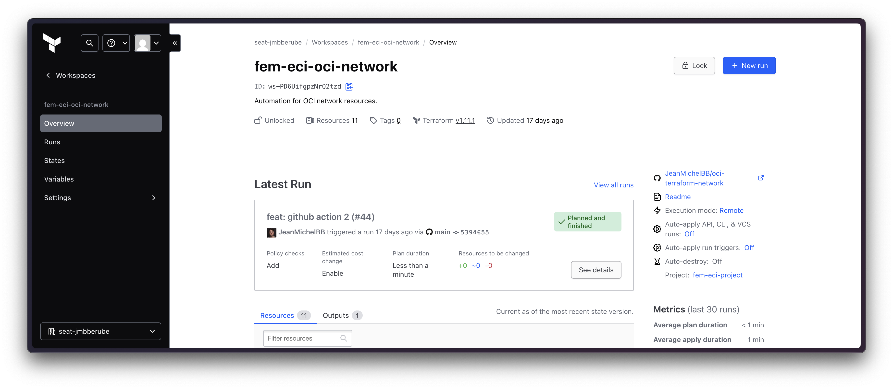

# oci-terraform-network



## Overview

This project provides a Terraform configuration to deploy a Virtual Cloud Network (VCN) and related resources on Oracle Cloud Infrastructure (OCI). It automates the creation of an instance, networking components, and security rules.

## Features

- **VCN & Subnet**: Defines a Virtual Cloud Network and a subnet.
- **Compute Instance**: Provisions an OCI instance with predefined specifications.
- **Security**: Configures ingress and egress rules for secure access.
- **Block Storage**: Attaches additional storage to the instance.
- **Internet Gateway**: Enables internet connectivity.
- **Terraform Automation**: Infrastructure as Code (IaC) approach.

## Prerequisites

- An OCI account with necessary permissions.
- Terraform installed ([Download Terraform](https://developer.hashicorp.com/terraform/downloads)).
- OCI CLI installed and configured ([OCI CLI Setup](https://docs.oracle.com/en-us/iaas/Content/API/SDKDocs/cliinstall.htm)).

## Deployment

1. Clone the repository:
   ```sh
   git clone https://github.com/yourusername/oci-terraform-network.git
   cd oci-terraform-network
   ```

2. Initialize Terraform:
   ```sh
   terraform init
   ```

3. Apply the configuration:
   ```sh
   terraform apply
   ```

   - Review the changes and confirm with `yes`.

## Configuration

Modify the `variables.tf` file to customize:
- `tenancy_ocid`
- `compartment_id`
- `instance_shape`
- `vcn_cidr`
- `security rules`

## Security Rules

The security list allows:
- **SSH (22)** from anywhere.
- **HTTP (80) & HTTPS (443)** for web access.
- **ICMP (Ping)** for network debugging.
- **All outbound (egress) traffic**.

## Cleanup

To destroy all resources:
```sh
terraform destroy
```

## License

MIT License. Feel free to use and modify.